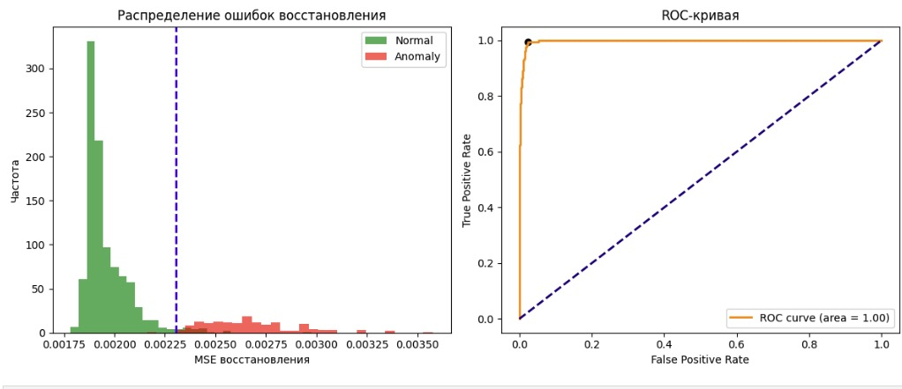
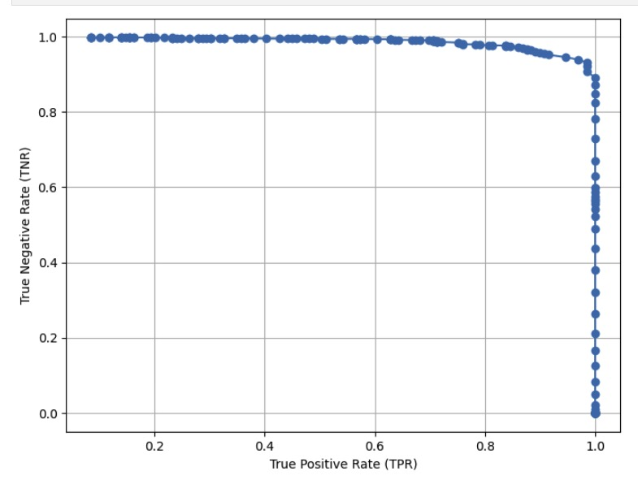

# ДЗ 2

### Author:
- Ионов Тимур Русланович

### Task:
- anomaly detection with autoencoder

### Dataset:
- Custom Proliv dataset

### Augmentations:

- RandomHorizontalFlip() 
- RandomVerticalFlip()
- RandomRotation(90)
- ColorJitter(brightness=0.2, contrast=0.2, saturation=0.2, hue=0.1),
- AddGaussianNoise(0, 0.01)

### Architectures (customized):
- [GatedCNN](https://arxiv.org/abs/1612.08083v3) encoder + simple decoder

### Hyperparameters: 
- optimizer: AdamW
- learning rate: 3e-5
- max epochs: 40
- batch size: 256

### Losses:
- HuberLoss

### Goals:

Целью данного эксперимента было решить задачу детекции аномалий с помощью автокодировщика.

### Metrics:
На валидации

На тесте:
- True Positive Rate (TPR): 0.9845
- True Negative Rate (TNR): 0.9356

### Results:

Модели сильно переобучались и на трейн, и на валидацию, поэтому приходилось регуляризовать модель в числе параметров (около 12K параметров всего) и в количестве эпох. Например, на графике изображен валидационный лосс. Модель, отвечающая голубой линии, единственная позволяет достичь метрик выше 0.91 на тесте. Остальные, хоть и лучше себя показывают на валидации и разделяют выборку с большим запасом, значительно хуже показывают себя на тесте.

