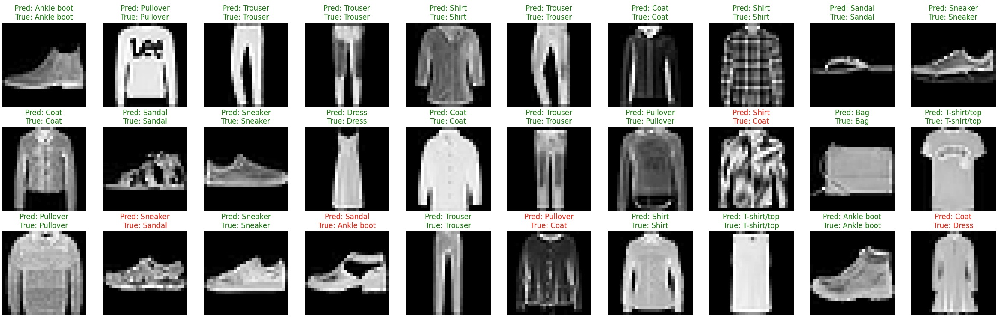
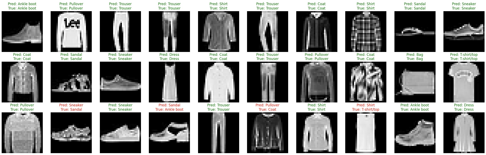
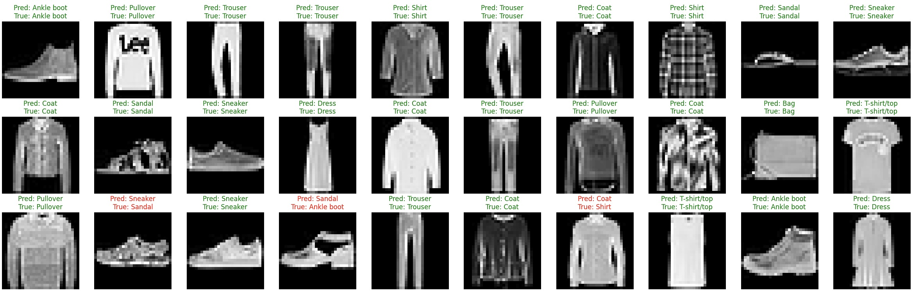

# ДЗ 1

### Author:
- Ионов Тимур Русланович

### Task:
- multiclass classification

### Dataset:
- Fashion MNIST

### Classes:
- T-shirt/top
- Trouser
- Pullover
- Dress
- Coat
- Sandal
- Shirt
- Sneaker
- Bag
- Ankle boot

### Augmentations:
- RandomHorizontalFlip() 
- RandomVerticalFlip()
- RandomRotation(90)

### Architectures (customized):
- SimpleCNN
- [SpatialAttentionCNN](https://arxiv.org/abs/1807.06521v2)  (sa)
- [GatedCNN](https://arxiv.org/abs/1612.08083v3)

### Hyperparameters: 
- optimizer: AdamW
- learning rate: 3e-4
- max epochs: 100
- batch size: 64

### Losses:
- CrossEntropy

### Metrics:

Column prefix is model name 

| Категория   | simple_Precision | simple_Recall | simple_F1 | sa_Precision | sa_Recall | sa_F1 | gated_Precision | gated_Recall | gated_F1 |
|-------------|------------------|---------------|-----------|--------------|-----------|-------|-----------------|--------------|----------|
| T-shirt/top | 0.824            | 0.824         | 0.824     | 0.862        | 0.862     | 0.862 | 0.865           | 0.865        | 0.865    |
| Trouser     | 0.978            | 0.978         | 0.978     | 0.969        | 0.969     | 0.969 | 0.979           | 0.979        | 0.979    |
| Pullover    | 0.852            | 0.852         | 0.852     | 0.892        | 0.892     | 0.892 | 0.842           | 0.842        | 0.842    |
| Dress       | 0.895            | 0.895         | 0.895     | 0.884        | 0.884     | 0.884 | 0.835           | 0.835        | 0.835    |
| Coat        | 0.872            | 0.872         | 0.872     | 0.821        | 0.821     | 0.821 | 0.921           | 0.921        | 0.921    |
| Sandal      | 0.957            | 0.957         | 0.957     | 0.924        | 0.924     | 0.924 | 0.955           | 0.955        | 0.955    |
| Shirt       | 0.653            | 0.653         | 0.653     | 0.671        | 0.671     | 0.671 | 0.656           | 0.656        | 0.656    |
| Sneaker     | 0.969            | 0.969         | 0.969     | 0.968        | 0.968     | 0.968 | 0.949           | 0.949        | 0.949    |
| Bag         | 0.976            | 0.976         | 0.976     | 0.960        | 0.960     | 0.960 | 0.960           | 0.960        | 0.960    |
| Ankle boot  | 0.955            | 0.955         | 0.955     | 0.957        | 0.957     | 0.957 | 0.966           | 0.966        | 0.966    |

### Debug plot:
#### simple:

#### spatial attention:

#### gated:

Resume:
Gated CNN использует механизмы "ворот", позволяющие контролировать поток информации через слои сети.
Это означает, что нейронная сеть может эффективно фильтровать и передавать только наиболее релевантные признаки (доп. регуляризация), что особенно полезно в задачах с высоким уровнем внутриклассовой изменчивости, как в случае с Fashion MNIST.